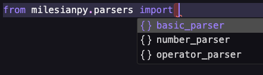

# milesianpy

A math calculation package.

## Usage



**Parsers**:

- `basic_parser`: A basic parser that can parse basic math expressions.
- `number_parser`: A parser that can parse numbers.
- `operator_parser`: A parser that can parse operators.

```python
from milesianpy.parsers import basic_parser

// TODO: add examples here.
```

## Installation

```bash
pip install milesianpy
```

## Development

### Setup

For first time setup:

```bash
make setup
```

> To build, publish, and clean the artifacts in one simple step, run:
> `make all`

### Building

To build the package, run:

```bash
make build
```

### Publishing

To publish the package to pypi, run:

```bash
make publish
```
